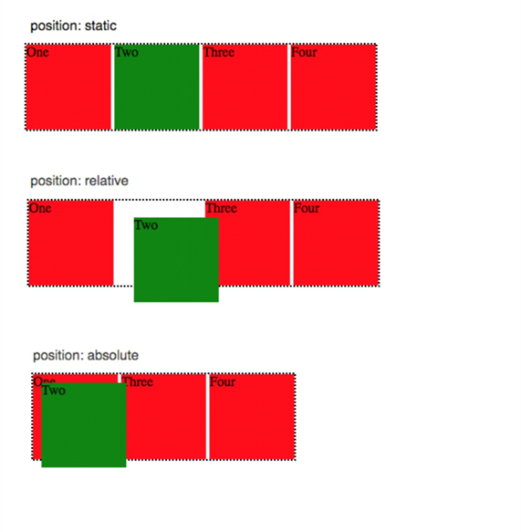

Difference between Relative and Absolute position?
----------------------------------------------------

Relative - position relative that means element relative to its current position without changing the layout around it

Absolute - position absolute places an element relative to its parents position and changing the layout around it.

Difference between visibility hidden and displaynone?
------------------------------------------------------

visibility:hidden - The element is in the DOM but its not visible.
display:none - The element is not in the DOM its does not exist inside the DOM.
