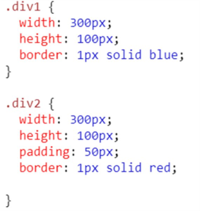
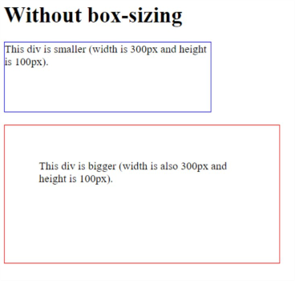
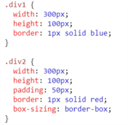
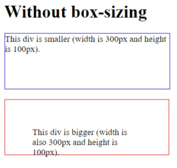
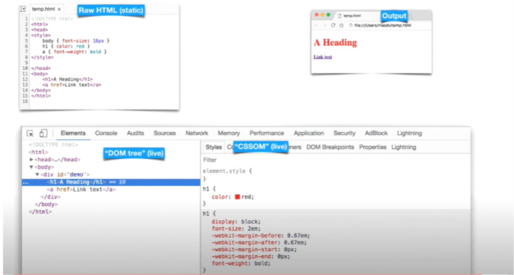

What are the features of CSS3?
-------------------------------
Features of CSS3
* Animations.
* Multiple Backgrounds & Gradient.
* Multiple Column layouts.
* Opacity.
* Rounded Corner:
* Selectors. Advanced

------------------------------------------------------------------------------------------------------

How To Add CSS
---------------
There are three ways of inserting a style sheet:

* External CSS-
----------------
To add a style sheet to HTML, we use the <link> tag in the header section of HTML page, like this:
 
 * Internal CSS
----------------
If you do not want to have a separate style sheet then you can simply write your CSS in the head section of HTML page.

        <head>
        
        </head>

* Inline CSS
----------------
You can code the CSS along with the HTML tags itself.

        
This is the content of my paragraph

------------------------------------------------------------------------------------------------------

What is CSS Box Model?
------------------------
The CSS box model is essentially a box that wraps around every HTML Element. IT contains of margin, border, padding and the actual content.

------------------------------------------------------------------------------------------------------

CSS Position
-------------
There are 5 types-

Static -
----------
* Static-HTML elements are positioned static by default.
* Static positioned elements are not affected by the top, bottom, left, and right properties.
* An element with position: static; is not positioned in any special way; it is always positioned according to the normal flow of the page.

Difference between Relative and Absolute position?
----------------------------------------------------

Relative - position relative that means element relative to its current position without changing the layout around it

Absolute - position absolute places an element relative to its parents position and changing the layout around it.

Difference between Fixed and Sticky position?
----------------------------------------------------

* Element with position fixed property is fixed to the viewport and doesn't move irrespective of scrolling.
* Fixed property never leaves the viewport position it was fixed too.

* Element with position sticky property can scroll to an offset value provided by the user.
* Sticky property leaves the viewport when its parents element scrolls off the viewport.

------------------------------------------------------------------------------------------------------

Difference between visibility hidden and displaynone?
------------------------------------------------------

* visibility:hidden - The element is in the DOM but its not visible.
* display:none - The element is not in the DOM its does not exist inside the DOM.

------------------------------------------------------------------------------------------------------

Z-Index
-----------
* The z-index property specifies the stack order of an element.

* An element with greater stack order is always in front of an element with a lower stack order.
Note: z-index only works on positioned elements (position: absolute, position: relative, position: fixed, or position: sticky) and flex items (elements that are direct children of display:flex elements).

* Note: If two positioned elements overlap without a z-index specified, the element positioned last in the HTML code will be shown on top.

------------------------------------------------------------------------------------------------------

Overflow
---------- 
* The overflow property specifies what should happen if content overflows an element's box.
* This property specifies whether to clip content or to add scrollbars when an element's content is too big to fit in a specified area.
* Note: The overflow property only works for block elements with a specified height.
* overflow-x and overflow-y to control horizontal and vertical overflow separately.

        CSS overflow types:

        visible – Default. Content spills out.
        hidden – Extra content is clipped (no scroll).
        scroll – Always shows scrollbars.
        auto – Scrollbars appear only when needed.
        clip – Clips content, no scroll allowed.

------------------------------------------------------------------------------------------------------

What is a Media Query?
---------------------------
Media queries can be used to check many things, such as:
    •	width and height of the viewport
    •	width and height of the device
    •	orientation (is the tablet/phone in landscape or portrait mode?)
    •	resolution

        /* Extra small devices (phones, 600px and down) */ @media only screen and (max-width: 600px) {...}
        /* Small devices (portrait tablets and large phones, 600px and up) */
        @media only screen and (min-width: 600px) {...}
        /* Medium devices (landscape tablets, 768px and up) */
        @media only screen and (min-width: 768px) {...}
        /* Large devices (laptops/desktops, 992px and up) */
        @media only screen and (min-width: 992px) {...}
        /* Extra large devices (large laptops and desktops, 1200px and up) */
        @media only screen and (min-width: 1200px) {...}

        Orientation: Portrait / Landscape
        @media only screen and (orientation: landscape) { body {
        background-color: lightblue;
        }
        }
------------------------------------------------------------------------------------------------------

🔹 All CSS Pseudo-Classes (:)
-------------------------------
        📌 User Action / UI State
        :hover
        :active
        :focus
        :focus-visible
        :focus-within
        :target
        :enabled
        :disabled
        :checked
        :indeterminate
        :default
        :valid
        :invalid
        :in-range
        :out-of-range
        :required
        :optional
        :read-only
        :read-write
        :placeholder-shown
        📌 Structural / Tree-Related
        :root
        :empty
        :first-child
        :last-child
        :only-child
        :nth-child(n)
        :nth-last-child(n)
        :first-of-type
        :last-of-type
        :only-of-type
        :nth-of-type(n)
        :nth-last-of-type(n)
        📌 Logical / Negation
        :not(selector)
        :is(selector)
        :where(selector)
        :has(selector) (experimental, supported in modern browsers)
        📌 Link States
        :link
        :visited
        :any-link
        :local-link
        📌 Language / Direction
        :lang(language)
        :dir(ltr|rtl)
        📌 Miscellaneous
        :fullscreen
        :picture-in-picture
        :defined (for custom elements)

------------------------------------------------------------------------------------------------------

🔸 All CSS Pseudo-Elements (::)
--------------------------------
        📌 Content Insertion
        ::before
        ::after
        📌 Text Styling
        ::first-letter
        ::first-line
        ::selection
        ::spelling-error
        ::grammar-error
        📌 Form Elements
        ::placeholder
        ::file-selector-button
        📌 Lists and UI
        ::marker
        ::cue (for WebVTT captions)
        ::cue-region
        📌 Media and Dialogs
        ::backdrop
        ::slotted(selector) (for Shadow DOM)

Advance selector
-----------------
        div p       /* Descendant */
        div > p     /* Direct child */
        div + p     /* Next sibling */
        div ~ p     /* General sibling */

------------------------------------------------------------------------------------------------------

Box-sizing-
------------
Without the CSS box-sizing Property
By default, the width and height of an element is calculated like this:
width + padding + border = actual width of an element height + padding + border = actual height of an element
This means: When you set the width/height of an element, the element often appears bigger than you have set (because the element's border and padding are added to the element's specified width/height).
Example-

------------------------------------------------------------------------------------------------------

CSS opacity
------------
The opacity property specifies the opacity/ transparency of an element.

------------------------------------------------------------------------------------------------------

CSS preprocessor
-----------------
* A CSS preprocessor is a program that lets you generate CSS from the preprocessor's own unique syntax.
* CSS preprocessors make it easy to automate repetitive tasks, reduce the number of errors and code bloat, create reusable code snippets, and ensure backward compatibility.
* Each CSS preprocessor has its own syntax that they compile into regular CSS so that browsers can render it on the client side. 

Examples: Sass, Less & Stylus

------------------------------------------------------------------------------------------------------

Transform
----------
The transform property applies a 2D or 3D transformation to an element. This property allows you to rotate, scale, move, skew, etc., elements.

------------------------------------------------------------------------------------------------------

How does a browser deal with the css?
--------------------------------------
Uses another program called CSS parser to convert raw CSS into cssom and cssom is also tree ike structure where each node represents style of various elements and from js perspective you can think of DOM and CSSOM as represented by a single object by the name document and then you can use APIs on this document object to make changes to both DOM and CSSOM.
We have HTML parser that loads HTML and creates DOM tree and then we have CSS parser that loads CSS file and then creates cssom tree.

------------------------------------------------------------------------------------------------------

In css, get detail understanding of specificity
-------------------------------------------------
Specificity is the set of rules of css follow in order to determine what the style of the elements should be Specificity means something is more specific then its has more weightage.

------------------------------------------------------------------------------------------------------

Difference between JPEG, PNG, and SVG 
---------------------------------------
* JPEG is a raster format best for photographs and images with many colors. It uses lossy compression, which reduces file size but can slightly degrade quality. It doesn't support transparency.

* PNG is also a raster format, but it uses lossless compression, preserving image quality. It's ideal for images that need transparency or sharp edges, like logos or UI elements.

* SVG is a vector format, meaning it's made of paths and shapes instead of pixels. It's infinitely scalable without losing quality and is perfect for icons, logos, and illustrations. SVGs are also editable with code and support interactivity and animation.

